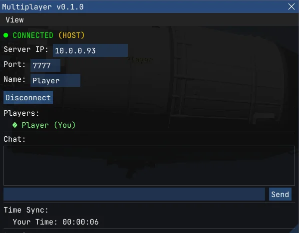

# KSA Multiplayer Mod

A multiplayer modification for Kitten Space Agency (KSA) that enables real-time cooperative gameplay where multiple players can see each other's spacecraft during orbital missions, maneuvers, and surface operations.

## Features

- **Real-time Vehicle Synchronization** - See other players' spacecraft in orbit and on surfaces
- **Event-based Architecture** - Efficient network updates only when significant state changes occur (engine ignition, throttle changes, RCS, maneuvers)
- **LMP-style Subspace System** - Players can time warp independently without breaking multiplayer
- **In-game Chat** - Communicate with other players
- **Player Nametags** - Visual indicators showing player names above their vehicles
- **Time Synchronization** - Sync to other players' simulation time when ready to rendezvous
- **System Validation** - Ensures all players are running the same solar system configuration
- **EVA Support** - Synchronizes KittenEva (astronaut) objects between players
- **Ghost Mode** - Out-of-sync players appear as markers on the map view only

## Repository Structure

```
KSA-Multiplayer-Mod/
├── KSA-Multiplayer-Mod/          # Source code
│   ├── src/                      # C# source files
│   │   ├── Messages/             # Network message definitions
│   │   ├── ModEntry.cs           # Mod entry point
│   │   ├── MultiplayerManager.cs # Core multiplayer logic
│   │   ├── MultiplayerWindow.cs  # ImGui UI
│   │   ├── NetworkManager.cs     # RakNet networking
│   │   ├── RemoteVehicleRenderer.cs
│   │   ├── SubspaceManager.cs    # Time warp handling
│   │   └── ...
│   ├── Build-And-Deploy.ps1      # Build script
│   ├── KSA-Multiplayer-Mod.csproj
│   ├── mod.toml
│   ├── LICENSE
│   └── CHANGELOG.md
│
└── KSA-Multiplayer-Package/      # Installer and distribution
    ├── Launcher/                 # ModLoader executable
    │   ├── KSA.ModLoader.exe
    │   ├── KSA.ModLoader.dll
    │   └── 0Harmony.dll
    ├── Content/Multiplayer/      # Mod files
    │   └── mod.toml
    ├── Install.ps1               # PowerShell installer
    ├── Install.bat               # Batch installer wrapper
    ├── installer.nsi             # NSIS installer script
    └── README.md                 # Detailed usage guide
```

## Requirements

### For Players (Using Pre-built Release)
- **Kitten Space Agency** v2994 or later
- **.NET 10 Desktop Runtime** - [Download here](https://dotnet.microsoft.com/en-us/download/dotnet/10.0)
  - Select ".NET Desktop Runtime" for Windows x64
- **Windows** (x64)

### For Developers (Building from Source)
- **.NET 10 SDK** (or .NET 9 SDK)
- **Kitten Space Agency** installed (for assembly references)
- **NSIS** (optional, for building the installer executable)

## Installation (For Players)

### Option 1: Installer (Recommended)
1. Download `KSA-Multiplayer-Setup.exe` from the [Releases](https://github.com/racerx2/KSA-Multiplayer-Mod/releases) page
2. Run the installer and select your KSA installation folder
3. Use the "KSA with Mods" desktop shortcut to launch

### Option 2: Manual Installation
1. Download `KSA.Mods.Multiplayer.dll` from the [Releases](https://github.com/racerx2/KSA-Multiplayer-Mod/releases) page
2. Download or clone the `KSA-Multiplayer-Package` folder
3. Run `Install.ps1` (right-click → Run with PowerShell) or `Install.bat`

For custom KSA paths:
```powershell
.\Install.ps1 -KSAPath "D:\Games\Kitten Space Agency"
```

## Building from Source

### Prerequisites

1. **.NET 10 SDK** - [Download here](https://dotnet.microsoft.com/en-us/download/dotnet/10.0)
   - Select "SDK" (not Runtime) for your platform
   - Verify installation: `dotnet --version` should show `10.x.x`

2. **Kitten Space Agency** installed
   - The project references DLLs directly from the KSA installation
   - Default expected path: `C:\Program Files\Kitten Space Agency`

### Dependencies

The project uses two types of dependencies:

#### NuGet Packages (Automatic)
These are downloaded automatically during `dotnet restore`:

| Package | Version | Purpose |
|---------|---------|---------|
| `Lib.Harmony` | 2.4.2 | Runtime method patching - outputs `0Harmony.dll` |
| `MemoryPack.Generator` | 1.21.3 | Source generator for binary serialization (compile-time only, no runtime DLL) |

#### KSA Assembly References (From Game Installation)
The project references these DLLs directly from your KSA installation. They are **not** copied to the output (set as `Private=false`):

| Assembly | Purpose |
|----------|---------|
| `KSA.dll` | Core game API |
| `Planet.Core.dll` | Planet/orbital mechanics |
| `Planet.Render.Core.dll` | Rendering systems |
| `Brutal.Framework.dll` | Game framework core |
| `Brutal.ImGui.dll` | UI system |
| `Brutal.ImGui.Abstractions.dll` | UI interfaces |
| `Brutal.ImGui.Extensions.dll` | UI extensions |
| `Brutal.RakNet.dll` | Networking (RakNet wrapper) |
| `Brutal.Core.Common.dll` | Common utilities |
| `Brutal.Core.Logging.dll` | Logging system |
| `Brutal.Core.Numerics.dll` | Math types (vectors, matrices) |
| `Brutal.Core.Strings.dll` | String utilities |
| `Tomlet.dll` | TOML parsing (mod configuration) |
| `MemoryPack.Core.dll` | Binary serialization runtime |

### Build Steps

#### Standard Build
```powershell
cd KSA-Multiplayer-Mod
dotnet restore    # Downloads NuGet packages
dotnet build --configuration Release
```

Output: `bin\Release\KSA.Mods.Multiplayer.dll`

#### If KSA Is Installed in a Non-Default Location
If KSA is not at `C:\Program Files\Kitten Space Agency`, you must update the `HintPath` entries in `KSA-Multiplayer-Mod.csproj`:

```xml
<!-- Change all occurrences of: -->
<HintPath>C:\Program Files\Kitten Space Agency\KSA.dll</HintPath>

<!-- To your actual path: -->
<HintPath>D:\Games\KSA\KSA.dll</HintPath>
```

There are 14 references to update. You can use find/replace in your editor.

### Build and Deploy (Development)
```powershell
.\Build-And-Deploy.ps1
```

This script:
1. Cleans previous build artifacts
2. Builds in Release configuration
3. Copies the DLL to your KSA installation (`Content\Multiplayer\`)
4. Copies the DLL to the Package folder (for distribution)
5. Creates a "KSA with Mods" desktop shortcut

**Note:** The script assumes KSA is at `C:\Program Files\Kitten Space Agency`. Edit the script if your path differs.

### Building the Installer

Requires [NSIS](https://nsis.sourceforge.io/) (Nullsoft Scriptable Install System):

1. Download and install NSIS from https://nsis.sourceforge.io/
2. Ensure `makensis` is in your PATH, or use the full path
3. Build:

```batch
cd KSA-Multiplayer-Package
makensis installer.nsi
```

Output: `KSA-Multiplayer-Setup.exe`

### Build Output Summary

After a successful build, you'll have:

| File | Location | Purpose |
|------|----------|---------|
| `KSA.Mods.Multiplayer.dll` | `bin\Release\` | The mod DLL (only file needed at runtime) |
| `0Harmony.dll` | NuGet cache | Already bundled in `KSA-Multiplayer-Package\Launcher\` |

The mod DLL is self-contained - it only needs the game's existing DLLs and the ModLoader (which includes Harmony).

## Usage

### Getting Started
1. Launch KSA using the "KSA with Mods" desktop shortcut
2. The Multiplayer window appears automatically



**Note:** If hosting, ensure the port (default: 7777) is forwarded in your router.

### Hosting a Game
1. Enter your desired **Port** (default: 7777)
2. Enter your **Name**
3. Click **Host**

Your local IP address will be shown - give this to players who want to join.

### Joining a Game
1. Enter the host's **Server IP** address
2. Enter the **Port** (must match host's port)
3. Enter your **Name**
4. Click **Join**

### The Multiplayer Window
- **Status indicator** - Green "CONNECTED" when online, shows HOST or CLIENT
- **Players list** - Shows all connected players with sync status icons
- **Chat** - Type messages and click Send (or press Enter)
- **Time Sync** - Shows your current simulation time; use the dropdown to sync with other players

### Important: System Matching
**All players must select the same solar system at game startup:**
- Solar System
- Earth and Moon  
- Earth Only

If systems don't match, the connection will be refused.

### Console Commands (Advanced)
For users who prefer the console, these commands are also available:
| Command | Description |
|---------|-------------|
| `mp_ui` | Toggle multiplayer UI window |
| `mp_host <name> <port> <max>` | Host a server |
| `mp_join <name> <ip> <port>` | Join a server |
| `mp_disconnect` | Disconnect from session |
| `mp_status` | Show connection status |
| `mp_chat <message>` | Send chat message |
| `mp_vehicles` | List remote vehicles |
| `mp_goto <playerName>` | Teleport to a player |
| `mp_clearlogs` | Clear log files |
| `mp_logdir` | Show log directory |

### Subspace System
Players can time warp independently:
- **In Sync (Yellow markers):** Players at same simulation time see each other's vessels in 3D and on map
- **Out of Sync (Red markers):** Players at different times appear as "ghosts" on map only
- **Sync Up:** Use the Time Sync dropdown in the UI to jump forward and match another player

## Architecture

This mod implements the **Luna Multiplayer (LMP) "immortal vessel" pattern**:

- Remote vehicles exist as real Vehicle objects but are excluded from physics simulation
- Only the controlling player simulates physics; others receive and render position updates
- Event-based synchronization transmits updates only on significant state changes
- KSA's deterministic Kepler orbital mechanics handle smooth motion between sync points
- Situation-aware coordinate systems (CCI for orbital, CCF for surface contact)

### Network Protocol
- **Transport:** RakNet (KSA's built-in networking)
- **Serialization:** MemoryPack (binary, efficient)
- **Message Types:** VehicleState, OrbitSync, TimeSync, Chat, SystemCheck, VehicleDesign

## Log Files

When debug logging is enabled, logs are written to:
`<KSA>\Content\Multiplayer\logs\`

Log files include: TimeSync, Subspace, Sync, Players, Network, Vehicles, Events, Renderer, Patches, NameTags

## Third-Party Libraries

These open-source libraries are used by the mod:

| Library | Version | License | Notes |
|---------|---------|---------|-------|
| [Harmony](https://github.com/pardeike/Harmony) | 2.4.2 | MIT | Bundled in `Launcher/0Harmony.dll` |
| [MemoryPack](https://github.com/Cysharp/MemoryPack) | 1.21.3 | MIT | Runtime DLL ships with KSA |

**For end users:** No separate installation required. Harmony is bundled with the installer, and MemoryPack is already part of KSA.

**For developers:** See [Building from Source](#building-from-source) for how these are acquired during build.

## Troubleshooting

| Issue | Solution |
|-------|----------|
| ".NET Desktop Runtime" error | Install .NET 10 Desktop Runtime from Microsoft |
| "System Mismatch" on connect | All players must select same solar system at startup |
| Mod doesn't load | Use "KSA with Mods" shortcut, not KSA.exe directly |
| Vehicles don't appear | Enable debug logging and check log files; ensure players are time-synced |

## License

MIT License - see [LICENSE](KSA-Multiplayer-Mod/LICENSE)

## Author

**RacerX** - [@racerx2](https://github.com/racerx2)

## Version

Current: **v0.1.0**

See [CHANGELOG](KSA-Multiplayer-Mod/CHANGELOG.md) for version history.
