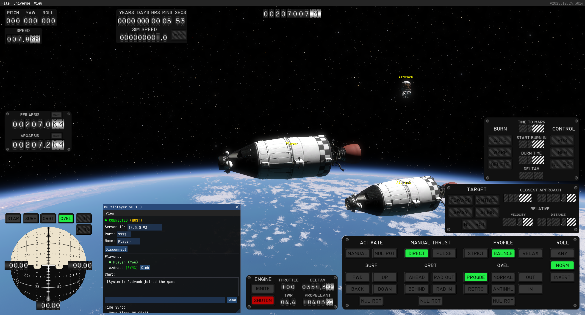

# KSA Multiplayer



A multiplayer modification for Kitten Space Agency (KSA) that enables real-time cooperative gameplay. Players can see each other's spacecraft during orbital missions, maneuvers, and surface operations.

## Architecture

This project uses a **dedicated server** architecture:

- **Server** - Standalone executable that relays messages between clients, manages authentication, and maintains authoritative game time
- **Client** - KSA mod that connects to the server and synchronizes vehicle data with other players

## Features

- **Dedicated Server** - Server runs independently; no player needs to host (requires KSA installation for game DLLs)
- **Real-time Vehicle Synchronization** - See other players' spacecraft in orbit and on surfaces
- **Shared Universe** - Starts empty, keeps all session vessels, and replays them to late joiners
- **Multiple Vessels** - Every launched or controlled vessel remains in the shared world
- **Event-based Architecture** - Efficient network updates only on significant state changes
- **In-game Chat** - Communicate with other players
- **Craft Sharing** - Upload a saved craft to the server, browse what others have shared, and download one into your vehicle folder to load from KSA's own VEHICLE SAVES window
- **Player Nametags** - Visual indicators showing player names above vehicles
- **Server-Authoritative Time Sync** - Keeps all players synchronized
- **System Validation** - Ensures all players run the same solar system
- **Version and Game Type Checks** - Refuses a client running a different mod version or Game Type, and says what to change
- **EVA Support** - Synchronizes astronaut objects between players
- **StarMap Compatible** - Works with both native KSA mod loading and [StarMap](https://github.com/StarMapLoader/StarMap) loader
- **Time Warp Support** - Players can warp independently; use Sync button to catch up

## Requirements

- Kitten Space Agency v2026.8.19.5261 or compatible
- Windows 10 or later
- Internet access during installation

The installer manages the compatible StarMap loader and its private .NET
runtime, so players do not need to maintain either dependency separately.

---

## Installation (End Users)

### Using the Installer (Recommended)

1. Download `KSA-Multiplayer-Setup-v0.4.0.exe` from [Releases](https://github.com/racerx2/KSA-Multiplayer-Mod/releases).
2. Run the installer and select your KSA installation folder.
3. Launch the game using the **KSA with Mods** desktop shortcut.

Setup installs the multiplayer client, a pinned StarMap loader, and a private
pinned .NET runtime. It does not install or start a dedicated server on the
player's PC.

### Manual Installation

1. Copy `Launcher/*` to `[KSA Install]\Launcher\`
2. Copy `Content/Multiplayer/*` to `[KSA Install]\Content\Multiplayer\`
3. Copy server files to `[KSA Install]\` root:
   - `RunServer.cmd`
   - `KSA-Dedicated-Server.dll`
   - `KSA-Dedicated-Server.deps.json`
   - `KSA-Dedicated-Server.runtimeconfig.json`
   - `server_config.json`
4. Add to `Content\manifest.toml`:
   ```toml
   [[mods]]
   id = "Multiplayer"
   enabled = true
   ```

### StarMap Mod Loader

This mod uses [StarMap](https://github.com/StarMapLoader/StarMap), the community
mod loader. Setup installs and configures the pinned compatible version
automatically, including its private .NET runtime.

---

## Running the Server

### Quick Start

1. Double-click the **KSA Dedicated Server** desktop shortcut
   - Or run `RunServer.cmd` from KSA installation folder

2. The server will start and display:
   ```
   ╔══════════════════════════════════════════╗
   ║      KSA DEDICATED SERVER v0.4.0         ║
   ╚══════════════════════════════════════════╝
   Server: KSA Multiplayer Server
   Port: 7777, Max Players: 8
   ```

### Server Configuration

Edit `server_config.json` in your KSA folder:

```json
{
  "port": 7777,
  "maxPlayers": 8,
  "systemId": "Sol",
  "systemDisplayName": "Solar System",
  "gameType": "Testing",
  "serverName": "My KSA Server",
  "motd": "Welcome to KSA Multiplayer!",
  "HostPlayerName": "",
  "password": "",
  "gamePath": "",
  "craftSharingEnabled": true,
  "maxSharedCraftPerPlayer": 32
}
```

| Setting | Description |
|---------|-------------|
| `port` | UDP port (default: 7777) |
| `maxPlayers` | Maximum concurrent players |
| `systemId` | `Sol`, `SolDense`, `EarthMoon`, or `Earth` — clients must match |
| `systemDisplayName` | Name shown to a client whose system differs |
| `gameType` | `Sandbox` or `Testing` — clients must match |
| `serverName` | Display name for your server |
| `motd` | Message shown to players on join |
| `HostPlayerName` | Player to mark with a star in the player list |
| `password` | Leave empty for no password |
| `gamePath` | KSA installation to load game DLLs from; empty auto-detects |
| `craftSharingEnabled` | Whether players may share craft through this server |
| `maxSharedCraftPerPlayer` | How many craft one player may keep in the library |

Shared craft are kept in a `shared_craft` folder beside the server executable,
one subdirectory per craft.

### Server Commands

| Command | Description |
|---------|-------------|
| `help` | Show available commands |
| `status` | Show server status and player count |
| `list` | List connected players |
| `kick <name>` | Kick a player by name |
| `ban <name>` | Ban a player (saves IP) |
| `unban <ip>` | Remove an IP from ban list |
| `banlist` | Show banned IPs |
| `craft list` | List every shared craft with its owner, size, and date |
| `craft remove <name>` | Delete a shared craft from the library |
| `say <message>` | Broadcast server message |
| `quit` | Graceful shutdown |

### Port Forwarding

To allow players outside your local network:
1. Forward port **7777 UDP** in your router
2. Point a DNS hostname at the router's public address
3. Players can use the same hostname for HTTPS and the game because HTTPS uses TCP 443 while KSA uses UDP 7777

---

## Running the Client

1. Double-click the **KSA with Mods** desktop shortcut
2. In-game, the Multiplayer window opens automatically
3. Enter connection details:
   - **Server address** - For example, `ksa.example.com`
   - **Port** - Server port (default: 7777)
4. Click **Connect**

If the server has a password set, enter it before connecting.

### Important Notes

- **All players must run the same solar system as configured in the server's `server_config.json`!** (Solar System, Earth and Moon, or Earth Only)
- System mismatch will show an error and disconnect
- Mod version and Game Type must also match the server, or the connection is refused

### Craft Sharing

The **Craft Sharing** section of the multiplayer panel appears once connected.

To share a craft:

1. Pick one of your saved craft from the **Share** dropdown
2. Click **Upload**

To take someone else's craft:

1. Click **Get** beside it in the shared list
2. Leave the multiplayer panel and open the **Vehicle Editor**
3. Open **VEHICLE SAVES** and double-click the craft to load it

Downloaded craft are written into your KSA vehicle folder as a normal craft, so
KSA lists them alongside your own. A download never overwrites a craft you
already have under that name — it installs beside it as `Name (Sharer)`.

**Rescan** re-reads your vehicle folder and asks the server for a fresh list.

### Time Sync & Subspace

Players can time warp independently:
- **In Sync** (green) - See each other's vessels in 3D
- **Out of Sync** (orange) - Vessels appear as "ghosts" (map only)
- **Sync Button** - Jump forward to match another player's time

---

## Development

### Prerequisites

- [.NET 10 SDK](https://dotnet.microsoft.com/en-us/download/dotnet/10.0)
- Kitten Space Agency installed (for assembly references)
- [NSIS](https://nsis.sourceforge.io/Download) (for building installer)

### Project Structure

```
KSA-Multiplayer/
├── Client/                      # Client mod source
│   ├── src/                     # C# source files
│   │   ├── Messages/            # Network message classes
│   │   ├── ModEntry.cs          # Mod entry point
│   │   ├── MultiplayerManager.cs
│   │   ├── NetworkPatches.cs    # Harmony patches
│   │   └── ...
│   ├── KSA-Multiplayer-Mod.csproj
│   └── mod.toml
│
├── Server/                      # Dedicated server source
│   ├── DedicatedServer.cs       # Main server logic
│   ├── ServerConfig.cs          # Configuration handling
│   ├── ServerConsole.cs         # Console UI
│   ├── KSA-Dedicated-Server.csproj
│   └── ...
│
├── KSA-Multiplayer-Package/     # Installer & distribution
│   ├── installer.nsi            # NSIS installer script
│   ├── build.bat                # Build script
│   ├── Content/Multiplayer/     # Client binaries
│   ├── Server/                  # Server binaries
│   └── Launcher/                # Mod loader
│
├── README.md
├── CHANGELOG.md
└── LICENSE
```

### Building the Client Mod

```powershell
cd Client
dotnet build -c Release
```

Output: `Client/bin/Release/KSA.Mods.Multiplayer.dll`

### One-command client update

Run the managed updater after pulling a new version:

```powershell
.\scripts\Update-KSAMultiplayer.ps1 -Launch
```

The updater requests administrator access, copies the packaged Multiplayer mod
into KSA, installs the pinned and SHA-256-verified StarMap version, installs a
private pinned .NET runtime for the loader, writes its KSA configuration, and
creates the **KSA with Mods** desktop shortcut. Multiplayer updates therefore do
not depend on a separately managed StarMap or system-wide .NET installation.

### Building the Server

```powershell
cd Server
dotnet build -c Release
```

Output: `Server/bin/Release/net10.0/KSA-Dedicated-Server.exe`

### Building the Installer Package

The `build.bat` script builds everything and creates the installer:

```powershell
cd KSA-Multiplayer-Package
.\build.bat
```

This will:
1. Build client mod (Release)
2. Build server (Release)
3. Copy binaries to package folders
4. Run NSIS to create `KSA-Multiplayer-Setup.exe`

### Manual Development Workflow

1. Build client:
   ```powershell
   cd Client
   dotnet build -c Release
   copy bin\Release\KSA.Mods.Multiplayer.dll "C:\Program Files\Kitten Space Agency\Content\Multiplayer\"
   ```

2. Build server:
   ```powershell
   cd Server
   dotnet build -c Release
   copy bin\Release\net10.0\KSA-Dedicated-Server.dll "C:\Program Files\Kitten Space Agency\"
   copy bin\Release\net10.0\KSA-Dedicated-Server.deps.json "C:\Program Files\Kitten Space Agency\"
   ```

3. Run server from KSA folder (uses system .NET 10):
   ```powershell
   cd "C:\Program Files\Kitten Space Agency"
   dotnet KSA-Dedicated-Server.dll
   ```

---

## Dependencies

| Component | Dependency | Version | License | Purpose |
|-----------|------------|---------|---------|---------|
| Client | [Harmony](https://github.com/pardeike/Harmony) | 2.x | MIT | Runtime method patching |
| Client | [MemoryPack](https://github.com/Cysharp/MemoryPack) | 1.x | MIT | Binary serialization |
| Server | Brutal Framework | - | - | Networking (RakNet) |
| Server | MemoryPack | 1.x | MIT | Binary serialization |

---

## Technical Details

The mod implements an "immortal vessel" pattern where remote vehicles exist as real Vehicle objects but are excluded from local physics simulation. Only the controlling player simulates physics; others receive position updates.

Key implementation:
- Dedicated server relays messages (star topology)
- Server-authoritative time synchronization (forward-only sync)
- Binary message serialization via MemoryPack
- Situation-aware coordinates (CCI for orbital, CCF for surface)
- Kepler orbital mechanics handle interpolation between sync points

---

## Known Limitations

- Surface vehicle synchronization less tested than orbital

## License

PolyForm Noncommercial License 1.0.0 - see [LICENSE](LICENSE)

Free for any noncommercial purpose, including personal projects, hobby use,
education, research, and nonprofit organisations. Commercial use requires a
separate licence from the author.

Required Notice: Copyright (c) 2025 RacerX (https://github.com/racerx2)

## Credits

- **Author and maintainer:** RacerX ([@racerx2](https://github.com/racerx2))

KSA Multiplayer is created and maintained by RacerX.

## Contributing

Contributions welcome! Submit issues and pull requests.

## Changelog

See [CHANGELOG.md](CHANGELOG.md)
